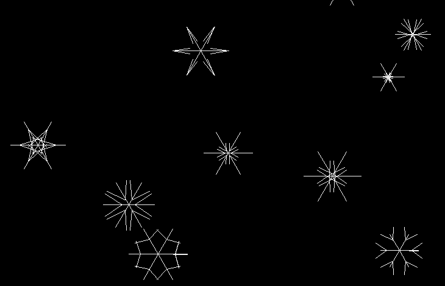

# Snowflakes Screensaver

**Snowflakes Screensaver** is a screensaver that shows falling snowflakes being blown away by the wind.

\
*Falling snowflakes on the screen*

The speed at which snowflakes fall, their number, and the acceleration of snowflakes by wind can be configured in the configuration file.

```
vim ./configs/config.yml
```

## System requirements

**Operating system:**

- Windows / MacOS / Linux

**Software:**

- Development tools for Python >=v3.6
- pip package manager for Python
- make utility

## Installation and launch

Before starting, you should download and install the packages that are used in this application.

```
pip install pyyaml pygame simple_draw
```

You can run the program with the command.

```
make fast-run
```

Or an equivalent command.

```
make
```
