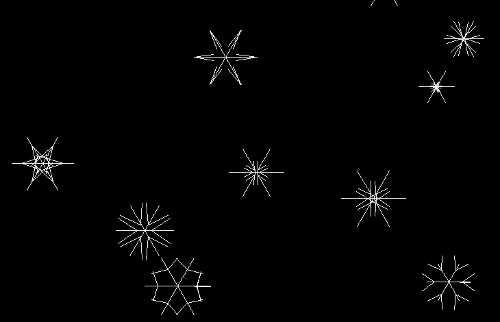

# Заставка "снежинки"

**Заставка "снежинки"** - это экранная заставка (хранитель экрана), которая показывает падающие снежинки, уносимые ветром.

\
*Падающие снежинки на экране*

Скорость падения снежинок, их количество и ускорение снежинок ветром можно настроить в файле конфигурации:

```
vim ./configs/config.yml
```

## Системные требования

**Операционная система:**

- Windows / MacOS / Linux.

**Программное обеспечение:**

- средства разработки языка Python >=v3.6;
- менеджер пакетов pip языка Python;
- утилита make.

## Установка и запуск

Перед запуском следует скачать и установить пакеты, которые используются в этом приложении.

```
pip install pyyaml pygame simple_draw
```

Запустить программу можно командой:

```
make fast-run
```

Или эквивалентной ей командой:

```
make
```
